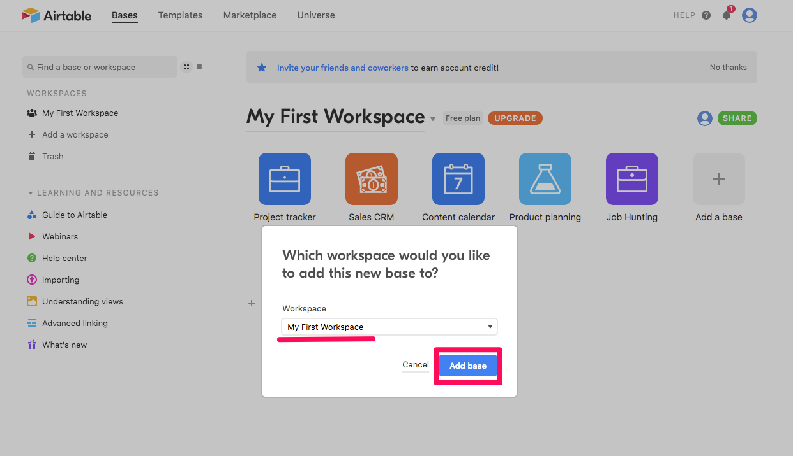

# 將 Meidum 文章匯入到 airtable 的工具
如果你正在因為 Medium 文章太多不知道如何管理的話，這是一個很方便的工具  
下面會完整說明使用這個工具的步驟

## 一、先完成 Airtable 的設定
1. 請[註冊或是登入airtable](https://airtable.com/login)  
    
2. 請[使用我已經創建好的template](https://airtable.com/shrqrLtvUxDyWFLjK/tblrYddyJH1cFQLm6/viwv6U7hnzgvKTZ14?blocks=hide)，進去後按右上角的Copy base
    
3. 選擇你要放base的位置(使用默認的即可)
    
4. 點擊剛剛創建的base，確認欄位都有複製過來
    
5. [進入accout頁面](https://airtable.com/account)產生API key，產生後請將key妥善保存，之後程式會用到這個參數(AIRTABLE_API_KEYKEY)
    
6. [進入api頁面](https://airtable.com/api)選擇剛剛新增的base
    
7. 依據下圖步驟找到base的代碼，並將他紀錄起來，之後程式會用到這個參數(AIRTABLE_BASE)
    

## 二、安裝本工具將指定 Medium 的部落格匯入 Airtable
> 開發所需要的前置環境設定我寫在這篇文章：[工程師的開發環境大補帖：Node.js、NVM、git、yarn、VSCode](https://babydragon9703111.medium.com/%E5%B7%A5%E7%A8%8B%E5%B8%AB%E7%9A%84%E9%96%8B%E7%99%BC%E7%92%B0%E5%A2%83%E5%A4%A7%E8%A3%9C%E5%B8%96-node-js-nvm-git-yarn-vscode-3f21ea161898#e634)
1. 從github下載
    ```
    git clone https://github.com/dean9703111/medium_to_airtable.git
    ```
2. 使用VSCode開啟資料夾，並點擊TERMINAL進入資料夾終端機
    
3. 安裝套件
    ```
    yarn
    ```
    
4. 設定專案環境變數
    將`.env.exmaple`複製一份到`.env`檔案(須自行新增)
    
    變數說明：
    - MEDIUM_PAGE：你要爬的Medium文章網址，你可以先用預設的值，確定程式能跑起來後再改成自己的網址
    - SHOW_BROSWER：設定為true時會有瀏覽器跳出來，設定為false時則是讓爬蟲背景執行
    - AIRTABLE_API_KEYKEY：在上面步驟申請到的API key
    - AIRTABLE_BASE：你目標要儲存BASE的代碼
    - WAIT_PAGE_SECOND：預設2000為2秒的意思，因為有些網路環境比較差會造成部分頁面load不完全，可自行調整為1000~5000
    
5. 執行程式
    ```
    yarn start
    ```
    我們可以從Terminal看到程式執行的過程
    
    結束後會顯示總共花費時間
    

## 三、驗收成果
去airtable確認是否有正確匯入資料，[此為範例](https://airtable.com/shrR0v4IDFB2rwUDj)


## 四、補充說明
因為有朋友表示用這個程式還需要在自己電腦建立環境實在是太過麻煩，所以我把他打包成執行檔(僅限macOS操作)，你可以clone這個專案或是直接下載`app/medium-to-airtable`  
下載後開啟資料的Terminal在底下輸入：
```
MEDIUM_PAGE="https://medium.com/你的網頁" SHOW_BROWSER=false AIRTABLE_API_KEYKEY='你申請的api' AIRTABLE_BASE='airtable的id' ./medium-to-airtable
```
就可以在沒有node的環境下執行嚕～  


>如果想要更深入了解這個Side Project的發想以及實作可以參考下面的文章喔:  
>[透過爬蟲讓 Airtable 管理你的 Medium 文章(上) — 遇到需求時的分析以及執行步驟](https://medium.com/dean-lin/%E9%80%8F%E9%81%8E%E7%88%AC%E8%9F%B2%E8%AE%93-airtable-%E7%AE%A1%E7%90%86%E4%BD%A0%E7%9A%84-medium-%E6%96%87%E7%AB%A0-%E4%B8%8A-%E9%81%87%E5%88%B0%E9%9C%80%E6%B1%82%E6%99%82%E7%9A%84%E5%88%86%E6%9E%90%E4%BB%A5%E5%8F%8A%E5%9F%B7%E8%A1%8C%E6%AD%A5%E9%A9%9F-69c29b1cea43)


